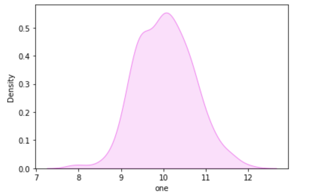
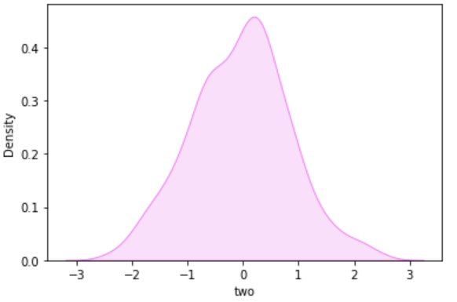
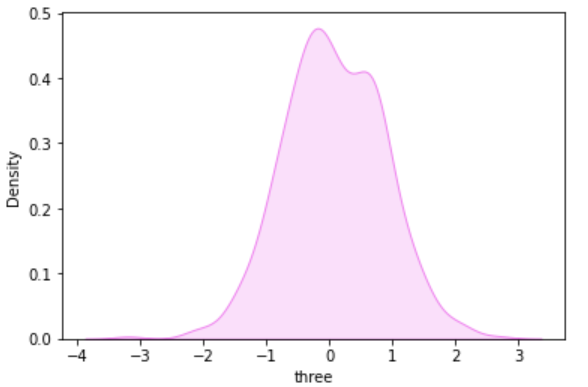
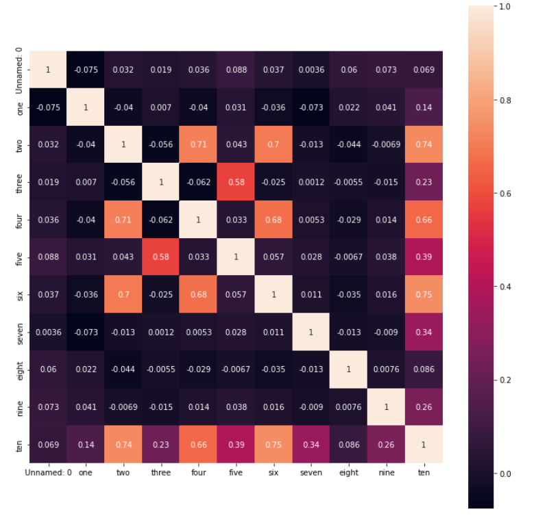
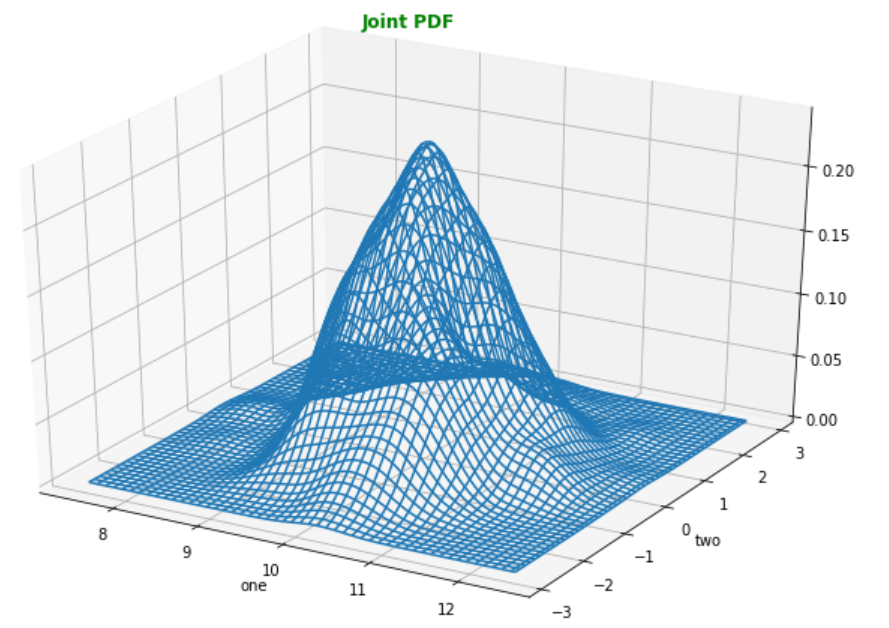
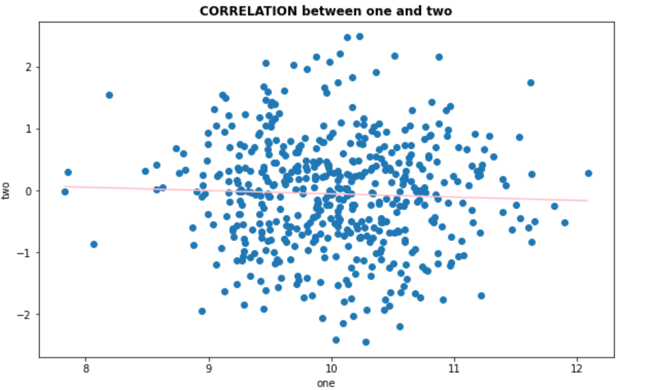
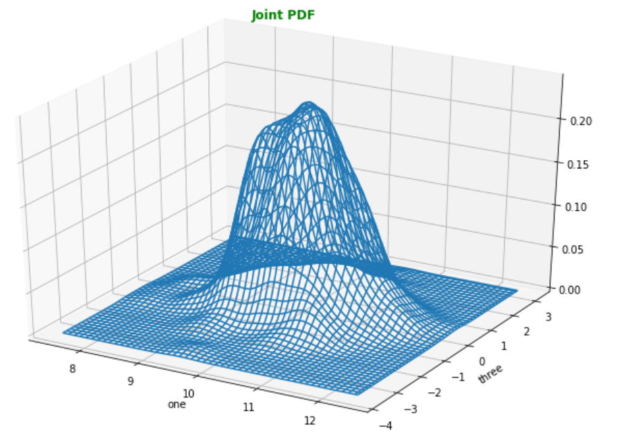
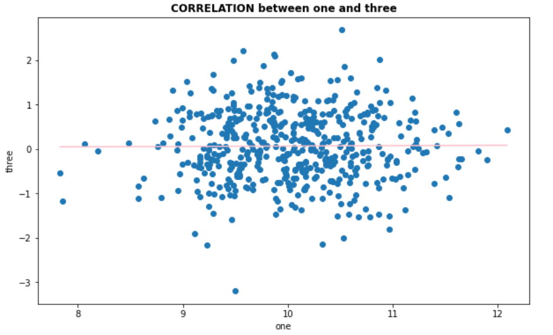
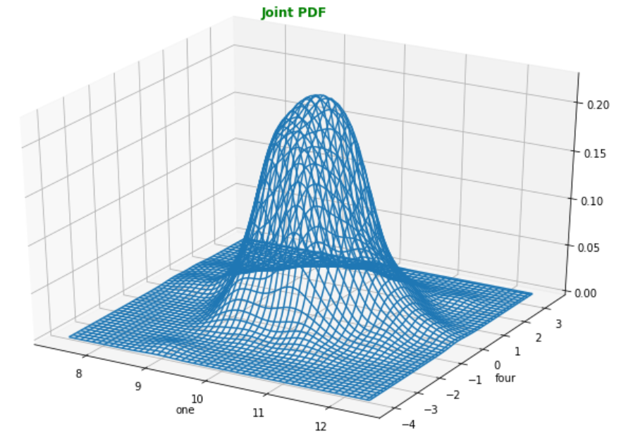
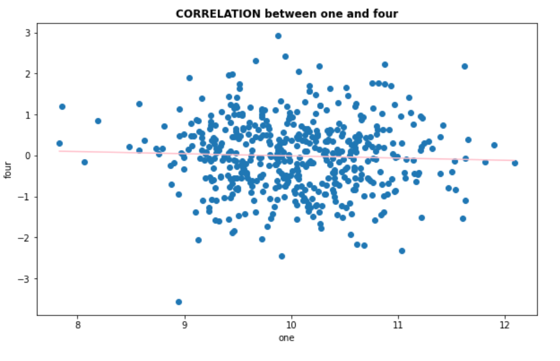

<h2>Dataset</h2>

The code imports necessary libraries such as <code>NumPy</code>, <code>Matplotlib</code>, <code>Seaborn</code>, <code>Pandas</code>, and <code>Scipy.stats</code> for data manipulation, visualization, and statistical analysis. It then reads a CSV file named "dataset.csv" and creates a list of column names. The code then plots kernel density estimation (KDE) plots for each column in the dataset using Seaborn's <code>kdeplot</code> function.

  <h3>KDE Plots</h3>
  
The following plots show the kernel density estimation (KDE) for each column in the dataset:

  

    <figure style="margin: 10px;">
      
      <figcaption>KDE Plot 1</figcaption>
    </figure>
    <figure style="margin: 10px;">
      
      <figcaption>KDE Plot 2</figcaption>
    </figure>
    <figure style="margin: 10px;">
      
      <figcaption>KDE Plot 3</figcaption>
    </figure>
  

  <h3>Correlation Heatmap</h3>
  
The following heatmap shows the correlation matrix between all pairs of columns in the dataset:

  <figure>
    
    <figcaption>Correlation Heatmap</figcaption>
  </figure>

  <h3>Joint Probability Distributions</h3>
  
The following plots show the joint probability distribution and correlation between each pair of columns in the dataset:

  

    <figure style="margin: 10px;">
      
      <figcaption>Wireframe Plot 1</figcaption>
    </figure>
    <figure style="margin: 10px;">
      
      <figcaption>Scatter Plot 1</figcaption>
    </figure>
    <figure style="margin: 10px;">
      
      <figcaption>Wireframe Plot 2</figcaption>
    </figure>
    <figure style="margin: 10px;">
      
      <figcaption>Scatter Plot 2</figcaption>
    </figure>
    <figure style="margin: 10px;">
      
      <figcaption>Wireframe Plot 3</figcaption>
    </figure>
    <figure style="margin: 10px;">
      
      <figcaption>Scatter Plot 3</figcaption>
    </figure>
  

  <h3>Outliers</h3>
  
The following proportions represent the number of data points that are more than 2.6 standard deviations away from the mean for
